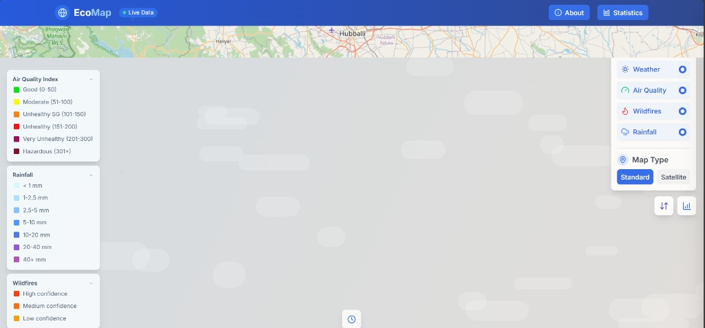

## Features

- **Interactive Map**: Visualize data on a dynamic map with layers for weather, air quality, and wildfire information.
- **Data Comparison Tools**: Compare datasets side-by-side for better insights.
- **Customizable Controls**: Adjust layers, timeframes, and search parameters to tailor the data to your needs.
- **Statistics Panel**: View detailed statistics and trends for selected datasets.
- **Geolocation Support**: Automatically detect your location for localized data.

### Overview 
1) The core of EcoMap is its interactive map interface, shown here centered on the user's location in Hubballi. Leveraging a powerful mapping API, the application provides a detailed and responsive base layer, setting the stage for the visualization of real-time environmental data. This view highlights the clean UI and the intuitive starting point for analysis.


2)This screenshot showcases EcoMap's primary functionality: fetching and displaying multiple live data layers via external APIs. The user can interact with the control panel on the right to toggle various environmental metrics, including Air Quality, Wildfires, and Rainfall. On the left, clear, color-coded legends automatically appear, allowing the user to easily interpret the live data being visualized on the map.
### Prerequisites
Ensure you have the following installed:

- [Node.js](https://nodejs.org/) (v16 or higher recommended)
- [npm](https://www.npmjs.com/) (comes with Node.js)
- **API Key**: Obtain an API key from the service provider of your choice (e.g., OpenWeatherMap, AirVisual, etc.) to enable live updates for weather, air quality, and other environmental data.

## Tech Stack

- **Frontend**: React with TypeScript
- **Styling**: Tailwind CSS and PostCSS
- **Build Tool**: Vite
- **State Management**: React hooks
- **APIs**: Custom services for weather, air quality, rainfall, and wildfire data

## Getting Started

Follow these steps to set up and run the project locally:


### Installation

1. Clone the repository:
   ```bash
   git clone https://github.com/your-repo/mocha.git
   cd mocha